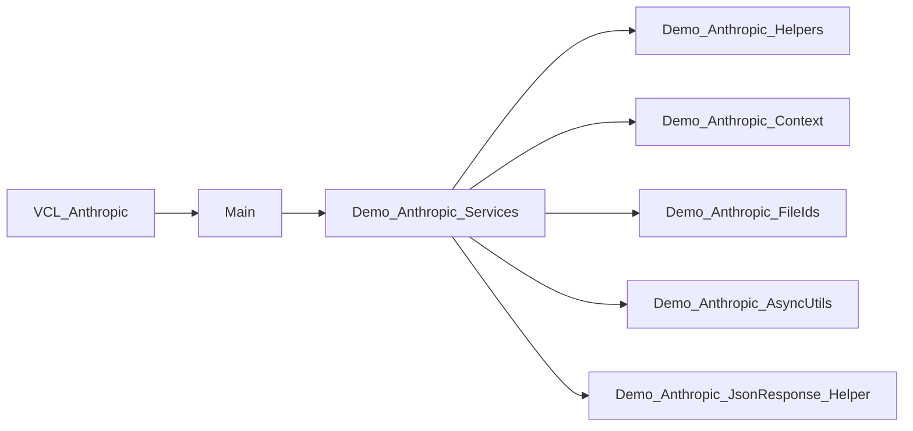

# VCL_Anthropic

> Purpose of this document: explain how the `VCL_Anthropic` demo implements **Pythia-Webview2** with a real LLM vendor, here Anthropic through the `DelphiAnthropic` SDK.
> The demo is not an exhaustive coverage of the Anthropic API. Its main purpose is to show where and how to plug a vendor into Pythia, while demonstrating a representative set of advanced features: streaming, files, vision, RAG/files, MCP, Anthropic skills, a custom skill, reasoning, and multi-turn context.

<br>

>[!IMPORTANT]
>
> `VCL_Anthropic` is a sample application. Its role is to show the integration contract between Pythia and a vendor SDK.
>
> The same pattern could be applied with `DelphiGenAI` for OpenAI, `DelphiGemini` for Gemini, or `DelphiMistralAI` for Mistral. Anthropic is used here as a concrete case, not as an architectural limit.

___

<br>

## 1. Positioning

`Pythia-Webview2` provides the desktop interface: WebView2, HTML/CSS/JS, chat bubbles, panels, cards, files, sessions, and the JavaScript bridge to Delphi.

`VCL_Anthropic` provides the vendor layer: it reads the state produced by Pythia, converts it into an Anthropic payload, calls the `DelphiAnthropic` SDK, streams the response back to the UI, and finalizes the conversation turn.

The demo therefore answers one precise question:

> How does a Delphi application take control of Pythia events and connect them to a real LLM vendor?

It does not try to reimplement all of Anthropic. It exposes enough surface area to understand the pattern:

- streamed text chat;
- vision through attached images;
- PDF and text documents;
- archives sent through the Files API;
- web search;
- thinking / reasoning;
- structured output;
- MCP;
- Anthropic skills (`xlsx`, `pptx`, `pdf`, `docx`);
- custom skill `delphi-uses-graph`;
- multi-turn context replay, including tool results and containers;
- saving `JsonPrompt` and `JsonResponse` so history can be replayed correctly.

---

## 2. Repository Location

| Element | Path | Role |
|---|---|---|
| VCL demo | `demos/VCL/pythia-anthropic` | Sample application that connects Pythia to Anthropic |
| Pythia component | `source` | Interfaces, event routing, adapters, VCL/FMX rendering, shared services |
| WebView2 UI | `assets` | HTML/CSS and JS templates injected into the WebView |
| UI scripts | `assets/scripts` | JS templates for bubbles, selectors, input, cards, sessions |
| Demo runtime data | `bin64/VCL_Anthropic/support` | JSON files for capabilities, models, MCP/skill/custom cards |
| Custom skill | `bin64/VCL_Anthropic/delphi-uses-graph` | Custom skill bundle that can be uploaded to Anthropic |

The main Delphi project is:

```text
demos/VCL/pythia-anthropic/VCL_Anthropic.dproj
```

---

## 3. Quick Architecture Read

Read the demo from top to bottom:

```text
Main.pas
  creates TVCLPythia
  wires ServiceAdapter
  creates TAnthropicServices after WebView2 initialization

VCL.WVPythia.Services.pas
  implements the application service expected by Pythia
  routes input-submit to AnthropicVendor.AsyncAwaitStreamChat

Demo.Anthropic.Services.pas
  builds the Anthropic payload
  handles streaming, tools, MCP, skills, files, finalization

Demo.Anthropic.Context.pas
  rebuilds Anthropic multi-turn history from PersistentChat

Demo.Anthropic.Helpers.pas
  converts TInputPromptState into Anthropic blocks and applies request parameters

Demo.Anthropic.Upload.pas
  implements IFileUploadService to upload archives through the Anthropic Files API

Demo.Anthropic.AsyncUtils.pas
  groups auxiliary asynchronous operations:
  session renaming, file retrieval, custom skill synchronization
```

---

## 4. The Pythia Contract to Implement

The heart of the integration is not in Anthropic. It is in `source`.

### 4.1. `IPythiaBrowser`

`source/WVPythia.Chat.Interfaces.pas` exposes `IPythiaBrowser`, the interface used by an application to drive the WebView2 surface:

- `Display`, `DisplayStream`, `DisplayError`, `DisplaySuccess` to write into the chat;
- `Prompt`, `PromptMedia` to render the user side;
- `CardSelectorShow`, `CardSelectorSetData`, `ModelsSelectorShow` for panels;
- `GetSkillCardsFileName`, `GetMcpCardsFileName`, `GetMediaFolder`, and related methods to locate runtime files;
- `FileUploadService` to delegate file upload to the vendor;
- `PersistentChat` to manage sessions and history.

In this demo, `TAnthropicServices` keeps a reference named `FBrowser: IPythiaBrowser`.

### 4.2. `IChatManagedItemDialogService`

`source/WVPythia.Adapter.pas` defines the adapter service that the WebView calls when the user performs an action:

```pascal
function ActivateManagedItemEvent(
  const AState: TInputPromptState;
  const AOnFinalize: TManagedItemFinalizeProc): Boolean;
```

This method is the important handoff point: it receives the `TInputPromptState` built by the DOM and a finalization callback. The vendor must handle the request, then call this callback with a `TManagedItemLLMResult`.

`source/WVPythia.ManagedItemService.pas` provides the base class `TCustomChatManagedItemDialogService`. The demo specializes it in `VCL.WVPythia.Services.pas`.

### 4.3. `TInputPromptState`

`source/WVPythia.Chat.ManagedFlow.pas` groups everything the user selected or typed:

- `Text`: prompt;
- `Models`: selected models;
- `Files`, `Images`, `KnowledgeSearch`: files and media;
- `Integration`: functions, MCP, skills, agents;
- `Thinking`, `WebSearch`, `DeepResearch`;
- `RequestParams`: system prompt, max tokens, temperature, stop strings, top-k, top-p, structured output;
- `Source`: raw JSON captured from the browser.

The demo turns this object into a `TStateBuffer` in `WVPythia.Vendors.Services.pas`, so payload building can use a simple structure detached from the UI classes.

### 4.4. `TManagedItemLLMResult`

The finalization callback expects a `TManagedItemLLMResult`:

- `UsedModel`;
- `Response`;
- `Reasoning`;
- `PromptJson`;
- `ResponseJson`;
- generated file/image/audio/video lists;
- optional error state.

Pythia then uses this object to update the UI and persist the turn in `PersistentChat`.

---

## 5. Demo Startup

`Main.pas` shows the minimum VCL-side setup:

```pascal
Pythia := TVCLPythia.Create(Panel2);
Pythia.OnApiKeyChanged := UpdateApiKey;
Pythia.ServiceAdapter := TVCLChatManagedItemDialogService.Create;
Pythia.OnInitialized := DoOnInitialized;
Pythia.Update;
```

Two points are essential:

- `ServiceAdapter` is supplied by the application. Pythia does not know how to call Anthropic by itself.
- `DoOnInitialized` is called after the WebView2 boot sequence; this is the right time to create the vendor, because runtime paths and internal Pythia services are available.

In `DoOnInitialized`, the demo creates:

```pascal
AnthropicVendor := TAnthropicServices.Create(
  Pythia,
  TAnthropicContext.CreateInstance(Pythia)
);
```

This line injects two dependencies into the vendor:

- the Pythia browser (`IPythiaBrowser`);
- the multi-turn context manager (`IContext`).

---

## 6. The VCL Application Service

`VCL.WVPythia.Services.pas` is intentionally thin. It adapts Pythia's abstract service to the demo.

The central method is:

```pascal
class function TToolContainer.ActivateInputState(
  const AState: TInputPromptState;
  const AOnFinalize: TManagedItemFinalizeProc): Boolean;
begin
  Result := True;
  AnthropicVendor.AsyncAwaitStreamChat(AState, AOnFinalize);
end;
```

This is where the Pythia world leaves the framework and enters the vendor. To integrate another SDK, this is exactly the delegation you would replace:

```text
Pythia input-submit
  -> TInputPromptState
  -> ServiceAdapter.ActivateManagedItemEvent
  -> Vendor.AsyncAwaitStreamChat
  -> TManagedItemLLMResult
  -> AOnFinalize
  -> Pythia UI + persistence
```

The other `TToolContainer` methods show the available extension points: function selection, MCP, skill, agent, custom item, settings, model selection, copy events, audio input. Several are marked `Todo`, because this demo focuses on the Anthropic vendor path.

---

## 7. The Anthropic Vendor

`Demo.Anthropic.Services.pas` implements `IVendorServices` with `TAnthropicServices`.

### 7.1. Initialization

The constructor:

- reads the `anthropic` API key from `ApiKeySecretStore`;
- triggers `/api-key new anthropic` when no key is configured;
- creates the SDK client with `TAnthropicFactory.CreateInstance`;
- configures the HTTP timeout;
- installs `TAnthropicClientUtils` for auxiliary operations;
- wires automatic session renaming;
- installs `TDownloadService` as the `IFileUploadService`;
- synchronizes custom skills declared in the skill card file.

This initialization shows that the vendor owns its own secrets, network client, and upload constraints. Pythia only provides the injection points.

There is an important design nuance here: not all Pythia services are wired in `Main.pas`.

`Main.pas` connects the generic application foundation:

```pascal
Pythia.ServiceAdapter := TVCLChatManagedItemDialogService.Create;
Pythia.OnApiKeyChanged := UpdateApiKey;
Pythia.OnInitialized := DoOnInitialized;
```

By contrast, services that directly depend on Anthropic are wired in `TAnthropicServices.Create`, because they only make sense for this vendor:

```pascal
FBrowser.OnChatSessionAutoRename := ChatSessionRename;
FBrowser.FileUploadService := TDownloadService.Create(FBrowser as IPythiaBrowser, FClient);
SkillCustomRegister;
```

These connections could technically have been made from `Main.pas`, but doing so would mix the Pythia host layer with Anthropic-specific details. Keeping them in `Demo.Anthropic.Services.pas` makes the responsibility clearer:

- `Main.pas` instantiates Pythia and the vendor;
- `VCL.WVPythia.Services.pas` adapts Pythia events to the application;
- `Demo.Anthropic.Services.pas` connects behaviors that require the Anthropic client.

This choice is especially visible for `FileUploadService`. Uploading an archive to the Files API is not a universal Pythia behavior: it is an Anthropic decision, because the file must become a `file_id` that can later be used in a `TContainerUploadBlockParam`. The service is therefore installed where the `FClient: IAnthropic` client already exists.

The same principle applies to automatic session renaming. Pythia exposes `OnChatSessionAutoRename`, but the renaming strategy belongs to the vendor: here, `TAnthropicClientUtils.ASyncSessionRename` calls a lightweight Anthropic model to produce a short title. Another integration could use another model, a local heuristic, or leave the hook disconnected.

### 7.1.1. Anthropic API Key Management

The API key follows the same separation.

Pythia provides the generic storage infrastructure through `ApiKeySecretStore` and the `/api-key new ...` command. The Anthropic demo only decides the logical key name:

```pascal
API_KEY_NAME = 'anthropic';
```

When the vendor starts, the constructor tries to read this key:

```pascal
if not FBrowser.ApiKeySecretStore.ReadSecret(API_KEY_NAME, Anthropic_key) then
  FBrowser.TryHandleAsCommand(Format('/api-key new %s', [API_KEY_NAME]));
```

If the key is missing, Pythia opens its API key entry flow through the command system. If the key exists, the vendor creates its client:

```pascal
FClient := TAnthropicFactory.CreateInstance(Anthropic_key);
```

When the user changes the key from Pythia, `Main.pas` receives the `OnApiKeyChanged` event and calls `AnthropicVendor.UpdateApiKey` only when the changed key is `anthropic`. `UpdateApiKey` then rereads the secret and updates `FClient.API.Token`.

This is useful for integrators: Pythia does not know vendor key names. It provides storage, the dialog, and the change event; each vendor chooses its identifier and knows how to apply the new value to its SDK.

### 7.2. Main Streaming Flow

`AsyncAwaitStreamChat` is the main entry point:

1. transforms `TInputPromptState` into `TStateBuffer`;
2. selects the text generation model;
3. builds and validates the Anthropic payload;
4. starts `FClient.Chat.AsyncAwaitCreateStream`;
5. sends text/reasoning deltas to `FBrowser.DisplayStream`;
6. accumulates request/response JSON;
7. finalizes through `TFinalizeData.Emit`.

On cancellation, the service checks `FBrowser.Escape`, displays the content already received, and still finalizes the turn with an abort marker.

### 7.3. Payload Construction

`BuildPayload` separates two concerns:

- conversation timeline: current content + history rebuilt by `IContext`;
- vendor parameters: model, system prompt, max tokens, sampling, thinking, tools, skills, MCP, beta flags.

The sub-builders keep this separation readable:

| Method | Role |
|---|---|
| `TMessageContentBuilder.BuildContentBlocks` | Converts text, images, documents, and archives into Anthropic blocks |
| `TRequestSettingsBuilder.Apply` | Applies system prompt, max tokens, temperature, stop, top-k, top-p |
| `ThinkingBuilder` | Translates Pythia `thinking` state into Anthropic `Thinking` |
| `OutputConfigBuilder` | Applies structured output and effort when active |
| `ToolsBuilder` | Enables web search, code execution, and MCP tools |
| `SkillBuilder` | Adds selected skills to the container |
| `MCPBuilder` | Reads MCP JSON cards and passes them to the payload |
| `BetaBuilder` | Merges beta flags required by the current turn and the history |

---

## 8. Demo Functional Coverage

This section lists what the demo actually covers. It is exhaustive for the demo, not for Anthropic.

| Feature | Coverage | Main files |
|---|---|---|
| Pythia VCL boot | Creates `TVCLPythia`, injects `ServiceAdapter`, `OnInitialized`, `Update` | `Main.pas` |
| DOM to Delphi bridge | Routes `input-submit` to `IChatManagedItemDialogService` | `source/WVPythia.Chat.EventManager.pas`, `source/WVPythia.Chat.EventHandlers.pas` |
| Vendor service | Delegates Pythia state to Anthropic | `VCL.WVPythia.Services.pas`, `Demo.Anthropic.Services.pas` |
| API key | Storage through `ApiKeySecretStore`, `/api-key new anthropic`, token update | `Main.pas`, `Demo.Anthropic.Services.pas` |
| Chat streaming | `AsyncAwaitCreateStream`, text/reasoning deltas, cancellation, finalization | `Demo.Anthropic.Services.pas` |
| Turn persistence | Return through `TManagedItemLLMResult`, preservation of `PromptJson`/`ResponseJson` | `Demo.Anthropic.Services.pas`, `source/WVPythia.Chat.ManagedFlow.pas` |
| Multi-turn context | Rebuilds user/assistant messages from `PersistentChat` | `Demo.Anthropic.Context.pas` |
| Text | `TTextBlockParam` block | `Demo.Anthropic.Helpers.pas` |
| Images | Base64 encoding + MIME type into `TImageBlockParam` | `Demo.Anthropic.Helpers.pas` |
| PDF | Base64 document block through `TBase64PDFSource` | `Demo.Anthropic.Helpers.pas` |
| Text / HTML / Markdown | Document block through `TPlainTextSource` | `Demo.Anthropic.Helpers.pas` |
| zip/tar/gz archives | Upload through Files API, then `TContainerUploadBlockParam.FileId` | `Demo.Anthropic.Upload.pas`, `Demo.Anthropic.Helpers.pas` |
| File upload state | JS statuses `uploading`, `ready`, `failed`, send button blocked during upload | `Demo.Anthropic.Upload.pas`, `source/WVPythia.Chat.Interfaces.pas` |
| File results | Extracts IDs produced by code execution, resolves names, downloads to media folder | `Demo.Anthropic.Services.pas`, `Demo.Anthropic.FileIds.pas`, `Demo.Anthropic.AsyncUtils.pas` |
| Web search | Adds `CreateWebSearchTool20250305` when `WebSearch` is active | `Demo.Anthropic.Services.pas` |
| Thinking | low/medium/high mapping, token budget, adaptive thinking for 4.6/4.7 models | `Demo.Anthropic.Services.pas`, `Demo.Anthropic.Helpers.pas` |
| Structured output | Uses `OutputConfig` when enabled in the settings panel | `Demo.Anthropic.Helpers.pas` |
| MCP | Reads MCP JSON cards, injects servers and toolsets | `Demo.Anthropic.Services.pas`, `bin64/VCL_Anthropic/support/VCL_Anthropic-mcp-cards.json` |
| Anthropic skills | Supports `xlsx`, `pptx`, `pdf`, `docx` as `anthropic` source | `Demo.Anthropic.Helpers.pas`, `Demo.Anthropic.Services.pas` |
| Custom skill | Supports any skill outside `xlsx/pptx/pdf/docx` as `custom` source | `Demo.Anthropic.Helpers.pas`, `Demo.Anthropic.AsyncUtils.pas` |
| Custom skill synchronization | Lists custom Anthropic skills, searches by `display_title`, creates when absent, patches local ID | `Demo.Anthropic.AsyncUtils.pas` |
| Session rename | Short summary through Anthropic Haiku, then Pythia session rename | `Demo.Anthropic.AsyncUtils.pas` |
| UI copy | Intercepts prompt/display/code copy through the application service | `VCL.WVPythia.Services.pas`, `assets/scripts/SelectorTemplate.js` |
| Errors | Displays through `DisplayError`, finalizes with `Error`/`ErrorMessage` | `Demo.Anthropic.Services.pas` |

What the demo intentionally does not cover:

- full native custom model selection dialog;
- full settings editing from Delphi;
- Anthropic agents;
- Anthropic media generation;
- speech-to-text / text-to-speech;
- deep research;
- complete application-side vectorization RAG pipeline;
- every tool and endpoint variant available from Anthropic.

These omissions are not Pythia limitations. They are scope choices that keep the demo readable.

---

## 9. Multi-Turn Context

The most important Anthropic-specific part is `Demo.Anthropic.Context.pas`.

A plain text history is not enough when a conversation uses:

- redacted thinking;
- server tool use;
- MCP tool use;
- code execution;
- container uploads;
- tool results;
- files produced by a previous execution.

`TAnthropicContext` reads `PersistentChat.CurrentChat`, skips the in-flight turn, then rebuilds each previous turn as a pair:

```text
user      -> JsonPrompt when available, otherwise plain text
assistant -> parsed JsonResponse when available, otherwise Response text
```

`TJsonResponseParser` turns streamed JSON events into block snapshots. Specialized builders then rebuild the blocks expected by the Anthropic API.

This reconstruction is required to avoid errors such as:

```text
tool_use was found without a corresponding tool_result block
```

or:

```text
Skills beta requires the code_execution tool to be included in the request
```

`BetaExtract` also reads previous `JsonPrompt` values to recover beta flags already used. The next turn can therefore re-register the beta flags and tools that are compatible with the conversation history.

---

## 10. Runtime Files and Cards

The demo configuration files live in:

```text
bin64/VCL_Anthropic/support
```

The most important ones for this demo are:

| File | Role |
|---|---|
| `VCL_Anthropic-capabilities.json` | Enables the visible Pythia buttons and panels |
| `VCL_Anthropic-model-list.json` | Lists the models shown by the selector |
| `VCL_Anthropic-mcp-cards.json` | Declares MCP entries usable by the Skills/MCP panel |
| `VCL_Anthropic-skill-cards.json` | Declares Anthropic and custom skills |
| `VCL_Anthropic-custom-cards.json` | Demo custom cards |

Pythia handles card display. The vendor then reads the selections from `TInputPromptState.Integration`.

Skill routing is done in `TParamsGetter.GetSkills`:

- `xlsx`, `pptx`, `pdf`, `docx` become `anthropic` skills;
- every other name becomes a `custom` skill, with its ID read from the JSON card.

---

## 11. The `delphi-uses-graph` Custom Skill

The demo includes a custom skill in:

```text
bin64/VCL_Anthropic/delphi-uses-graph
```

Structure:

```text
delphi-uses-graph/
  SKILL.md
  reference.md
  scripts/
    tool.py
```

This skill analyzes a Delphi/Object Pascal project and extracts the `uses` dependency graph between units. It produces:

- `dependencies.json`;
- `uses-graph.mmd`;
- `uses-graph.dot`;
- `uses-graph.svg` when Graphviz is available;
- `report.md`.

It is especially well suited for this demo for four reasons:

- it is rare in the Delphi ecosystem;
- it can analyze the demo itself, which makes the result very concrete;
- it does not depend on an external service while the skill runs: uploading an archive is enough;
- it combines well with document skills, for example to produce or analyze a final report.

### 11.1. Local Card

The card lives in:

```text
bin64/VCL_Anthropic/support/VCL_Anthropic-skill-cards.json
```

It contains an entry like:

```json
{
  "name": "delphi-uses-graph",
  "commentaire": "source: custom - Delphi `uses` dependency graph (Mermaid/DOT/SVG + cycles)",
  "badge": "\\uE496",
  "content": "custom",
  "id": "skill_..."
}
```

The ID is the Anthropic server-side ID. It can be missing, obsolete, or different depending on the workspace.

### 11.2. ID Synchronization

On startup, `TAnthropicServices.SkillCustomRegister` extracts custom cards, then calls:

```pascal
FClientUtils.CustomSkillRegister(Item.ID, Item.Name);
```

The logic in `Demo.Anthropic.AsyncUtils.pas` is:

1. list custom skills on the Anthropic side;
2. search for a skill whose `DisplayTitle` matches the card `name`, for example `delphi-uses-graph`;
3. if the skill exists and the local ID differs, update the JSON card;
4. if the skill does not exist, upload the `bin64/VCL_Anthropic/delphi-uses-graph` folder with `Skills.Create(Payload)`, then write the returned ID into the card.

This approach avoids depending on a stale local ID.

### 11.3. Recommended Demo Scenario

Prepare an archive of:

```text
demos/VCL/pythia-anthropic
```

Then select the `delphi-uses-graph` skill in the Skills panel and attach the archive to the prompt.

Example prompt:

```text
Here is an archive of my Delphi project. Use the delphi-uses-graph skill to produce the uses graph between units. Filter the prefixes System,Winapi,Vcl,FMX,Anthropic,WVPythia so only my Demo.* units remain. Display the Mermaid diagram inline, and summarize the most depended-on units as well as any cycles.
```

The model should then use the skill, run `scripts/tool.py`, read `report.md`, embed the Mermaid diagram, and attach the produced artifacts.

An expected graph looks like this:



---

## 12. Complete User Flow

A typical chat turn follows this path:

```text
1. The user types a prompt in the WebView.
2. The JS templates assemble the state: text, files, models, cards, settings.
3. The WebView posts an `input-submit` event.
4. `TBrowserEventManager` routes the event to the handlers.
5. The handlers deserialize a `TInputPromptState`.
6. `TVCLChatManagedItemDialogService` receives the state.
7. `TToolContainer.ActivateInputState` calls `AnthropicVendor.AsyncAwaitStreamChat`.
8. `TAnthropicServices` builds the Anthropic payload.
9. The SDK streams deltas.
10. The demo calls `FBrowser.DisplayStream`.
11. At the end, `TFinalizeData.Emit` produces a `TManagedItemLLMResult`.
12. Pythia persists the turn, updates the UI, and makes the session reusable.
```

This flow is the skeleton to reproduce for any other vendor.

---

## 13. Adapting Another Vendor

To replace Anthropic with another SDK, keep Pythia and replace only the vendor layer.

The steps are:

1. create a service equivalent to `TAnthropicServices`;
2. read `TInputPromptState` or `TStateBuffer`;
3. choose the model from `State.Models`;
4. convert files/images/settings into the target SDK format;
5. stream the response with `IPythiaBrowser.DisplayStream`;
6. produce a final `TManagedItemLLMResult`;
7. call `AOnFinalize`.

The Pythia side does not change:

```pascal
Pythia.ServiceAdapter := TVCLChatManagedItemDialogService.Create;
```

Only the target of this call changes:

```pascal
AnthropicVendor.AsyncAwaitStreamChat(AState, AOnFinalize);
```

For OpenAI, Gemini, or Mistral, the vendor service would have the same general shape, but different payload builders.

---

## 14. Watch Points

- Call the `AOnFinalize` callback, even on error or cancellation, so Pythia can close the turn cleanly.
- Preserve `PromptJson` and `ResponseJson` when the vendor needs them to rebuild history.
- Do not assume files are ready immediately: `IFileUploadService.PendingCount` is used to block sending.
- Pythia cards provide a UI selection; the vendor still has to interpret their content.
- Custom skill IDs are workspace-specific on Anthropic; they must be synchronized, not hard-coded forever.
- Anthropic tools already used in history can require beta/tool registration on subsequent turns.

---

## 15. Summary

`VCL_Anthropic` is a vendor integration demo, not a complete Anthropic client.

It shows:

- how to host Pythia in a VCL application;
- how to receive `TInputPromptState` through the `ServiceAdapter`;
- how to convert that state into a vendor SDK request;
- how to stream back to the UI;
- how to finalize with `TManagedItemLLMResult`;
- how to handle files, MCP, skills, and multi-turn context;
- how to declare and synchronize a useful custom skill, `delphi-uses-graph`.

Once this mechanism is understood, the same pattern can connect other vendors without changing Pythia's WebView2 layer.
